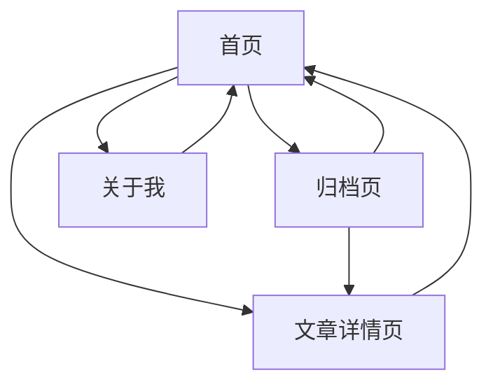

## 1. 产品概述

「轩仔的博客」是一个面向技术创作者的个人博客平台，专注于技术内容分享与个人思考记录。博客采用深色现代设计风格，提供沉浸式阅读体验，适合长期维护与持续写作。

目标用户为技术开发者、程序员以及对技术思考感兴趣的人群，通过高质量的技术文章和个人感悟分享，建立个人技术品牌与影响力。

## 2. 核心功能

### 2.1 用户角色

本博客为个人博客，主要面向访客用户，无需复杂的用户角色区分。

| 角色类型 | 访问方式 | 核心权限             |
| ---- | ---- | ---------------- |
| 访客用户 | 直接访问 | 浏览文章、查看归档、阅读关于页面 |

### 2.2 功能模块

博客包含以下核心页面：

1. **首页**：文章列表展示、个人信息展示、快捷入口
2. **文章详情页**：Markdown内容渲染、代码高亮、目录导航
3. **归档页**：按时间分组的文章归档展示
4. **关于我**：个人背景介绍、技术方向、博客初衷

### 2.3 页面详情

| 页面名称  | 模块名称   | 功能描述                         |
| ----- | ------ | ---------------------------- |
| 首页    | 文章列表区域 | 展示所有文章标题、摘要、发布时间、标签，支持分页浏览   |
| 首页    | 个人信息栏  | 显示头像、博客名称、个人简介、GitHub链接、项目链接 |
| 首页    | 快捷功能   | 最近文章展示、标签云导航                 |
| 文章详情页 | 内容渲染区  | Markdown格式渲染、多语言代码高亮、数学公式支持  |
| 文章详情页 | 目录导航   | 自动生成文章目录，支持锚点跳转              |
| 文章详情页 | 阅读进度   | 显示当前阅读位置和文章长度                |
| 归档页   | 时间分组   | 按年份和月份分组展示历史文章               |
| 归档页   | 快速导航   | 支持按时间快速定位特定文章                |
| 关于我   | 个人介绍   | 展示个人背景、技术方向、项目经历             |
| 关于我   | 博客说明   | 阐述博客创建初衷和内容定位                |

## 3. 核心流程

### 访客用户流程

1. 访问首页 → 浏览文章列表 → 点击感兴趣的文章 → 进入详情页阅读
2. 访问首页 → 点击归档链接 → 浏览历史文章 → 选择特定文章阅读
3. 访问首页 → 点击关于我 → 了解博主信息 → 返回继续浏览文章

## 4. 用户界面设计

### 4.1 设计风格

* **主色调**：深灰色（#1a1a1a）、深蓝色（#0f172a）、黑色（#000000）

* **强调色**：青色（#06b6d4）、蓝色（#3b82f6）

* **按钮样式**：圆角设计，hover状态有轻微发光效果

* **字体方案**：等宽字体用于代码（JetBrains Mono），无衬线字体用于正文（Inter）

* **布局风格**：卡片式布局，左侧内容区+右侧信息栏

* **图标风格**：简约线性图标，与整体深色主题协调

### 4.2 页面设计概览

| 页面名称  | 模块名称  | UI元素                                                  |
| ----- | ----- | ----------------------------------------------------- |
| 首页    | 文章列表  | 深色卡片背景，标题使用大字号（24px），摘要使用中等字号（16px），标签使用彩色小圆点标识       |
| 首页    | 个人信息栏 | 圆形头像（120px），博客名称使用大标题（32px），简介使用灰色文字（14px），社交链接使用图标按钮 |
| 文章详情页 | 内容区   | 白色文字（#e5e7eb）在深灰背景上，代码块使用深色主题高亮，行间距1.6倍               |
| 文章详情页 | 目录导航  | 固定在右侧，使用锚点链接，当前章节高亮显示                                 |
| 归档页   | 时间分组  | 年份使用大标题（28px），月份使用中标题（20px），文章列表使用简洁文本链接              |
| 关于我   | 个人介绍  | 分段式布局，使用卡片分隔不同内容模块，配图使用圆角矩形                           |

### 4.3 响应式设计

* **桌面端优先**：默认采用左右双栏布局

* **平板适配**：中等屏幕尺寸时调整栏宽比例

* **移动端优化**：小屏幕自动切换为上下单栏布局，侧边栏置于底部

* **触摸交互**：按钮和链接增加触摸目标区域，支持滑动浏览

### 4.4 性能优化

* **首屏加载**：采用静态生成，确保首屏渲染时间 < 1秒

* **图片优化**：支持WebP格式，图片懒加载

* **代码分割**：按需加载JavaScript代码

* **缓存策略**：合理的HTTP缓存头配置

* **SEO优化**：完整的meta标签、结构化数据、语义

