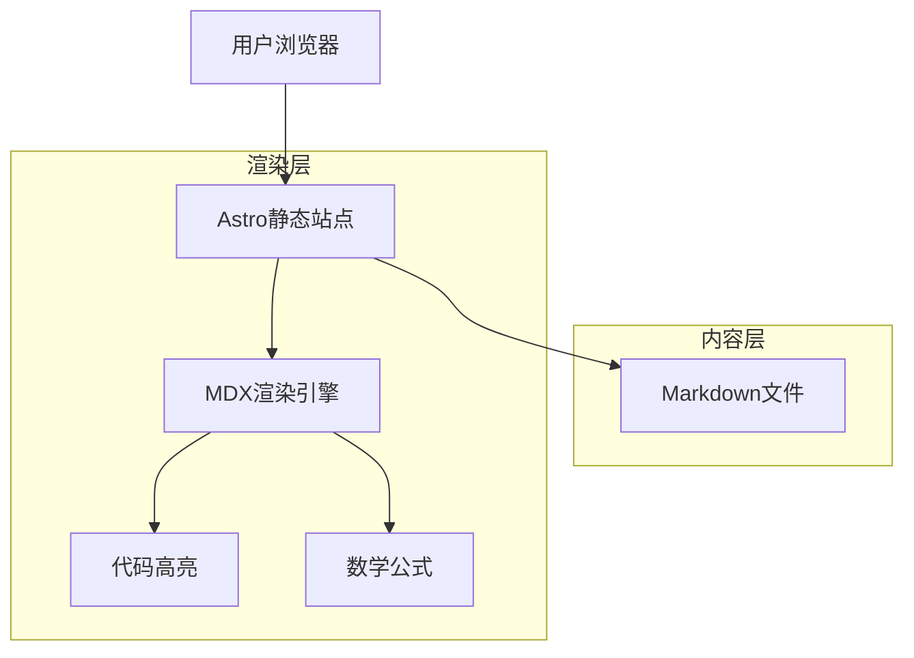

## 1. 架构设计



## 2. 技术描述

- **前端框架**：Astro@4 + React@18组件
- **样式方案**：Tailwind CSS@3 + 自定义深色主题
- **内容管理**：Markdown + Front Matter + MDX
- **代码高亮**：Shiki语法高亮器
- **构建工具**：Vite（Astro内置）
- **部署平台**：Netlify（静态站点托管）
- **初始化工具**：create-astro

**技术选择理由**：
- **Astro**：静态站点生成器，首屏加载极快，SEO友好，支持Markdown和MDX
- **Tailwind CSS**：快速构建响应式深色主题，减少自定义CSS工作量
- **文件式内容管理**：无需数据库，便于版本控制和内容迁移
- **Netlify部署**：支持自动构建和CDN分发，适合个人博客

## 3. 路由定义

| 路由路径 | 页面用途 |
|---------|----------|
| / | 首页，展示文章列表和个人信息 |
| /posts/[slug] | 文章详情页，渲染Markdown内容 |
| /archive | 归档页，按时间分组展示所有文章 |
| /about | 关于我页面，展示个人信息和博客介绍 |
| /tags/[tag] | 标签页，展示特定标签下的文章 |
| /rss.xml | RSS订阅源 |

## 4. 项目结构

```
xuanzai-blog/
├── src/
│   ├── components/          # React组件
│   │   ├── ArticleCard.astro
│   │   ├── ArticleList.astro
│   │   ├── Sidebar.astro
│   │   ├── TableOfContents.astro
│   │   └── CodeBlock.astro
│   ├── layouts/            # 布局模板
│   │   ├── BaseLayout.astro
│   │   ├── BlogLayout.astro
│   │   └── ArticleLayout.astro
│   ├── pages/              # 页面路由
│   │   ├── index.astro
│   │   ├── posts/[...slug].astro
│   │   ├── archive.astro
│   │   ├── about.astro
│   │   └── tags/[tag].astro
│   ├── styles/             # 样式文件
│   │   └── global.css
│   ├── utils/              # 工具函数
│   │   ├── date.ts
│   │   └── markdown.ts
│   └── types/              # TypeScript类型定义
│       └── article.ts
├── content/                # 文章内容
│   ├── posts/              # 文章Markdown文件
│   │   ├── why-nodejs-blog.md
│   │   ├── tech-blog-thinking.md
│   │   ├── knowledge-system.md
│   │   ├── writing-blog.md
│   │   └── learning-confusion.md
│   └── config/             # 配置文件
│       ├── author.json
│       └── site.json
├── public/                 # 静态资源
│   ├── images/
│   ├── favicon.ico
│   └── robots.txt
├── astro.config.mjs        # Astro配置文件
├── tailwind.config.js      # Tailwind配置
├── tsconfig.json           # TypeScript配置
├── package.json
└── netlify.toml           # Netlify部署配置
```

## 5. 数据模型

### 5.1 文章元数据结构

```typescript
interface ArticleFrontMatter {
  title: string
  description: string
  publishedAt: string
  updatedAt?: string
  tags: string[]
  category: 'tech' | 'essay' | 'project'
  coverImage?: string
  readingTime: number
  draft?: boolean
}

interface Article {
  slug: string
  frontmatter: ArticleFrontMatter
  content: string
  excerpt: string
}
```

### 5.2 站点配置

```typescript
interface SiteConfig {
  title: string
  description: string
  author: string
  url: string
  social: {
    github: string
    twitter?: string
    email: string
  }
  navigation: Array<{
    name: string
    href: string
  }>
}
```

## 6. 核心功能实现

### 6.1 文章加载与处理

```typescript
// src/utils/markdown.ts
import { getCollection } from 'astro:content'

export async function getAllArticles() {
  const articles = await getCollection('posts')
  return articles
    .filter(article => !article.data.draft)
    .sort((a, b) => 
      new Date(b.data.publishedAt).getTime() - 
      new Date(a.data.publishedAt).getTime()
    )
}

export function getArticlesByTag(articles: any[], tag: string) {
  return articles.filter(article => 
    article.data.tags.includes(tag)
  )
}
```

### 6.2 深色主题配置

```javascript
// tailwind.config.js
module.exports = {
  darkMode: 'class',
  content: ['./src/**/*.{astro,html,js,jsx,md,mdx,svelte,ts,tsx,vue}'],
  theme: {
    extend: {
      colors: {
        primary: {
          50: '#f0f9ff',
          500: '#06b6d4',
          600: '#0891b2',
          900: '#164e63'
        },
        dark: {
          100: '#f1f5f9',
          800: '#1e293b',
          900: '#0f172a'
        }
      }
    }
  }
}
```

## 7. 部署配置

### 7.1 Netlify配置

```toml
# netlify.toml
[build]
  command = "npm run build"
  publish = "dist"

[build.environment]
  NODE_VERSION = "18"

[[redirects]]
  from = "/rss"
  to = "/rss.xml"
  status = 200

[[headers]]
  for = "/*"
  [headers.values]
    X-Frame-Options = "DENY"
    X-XSS-Protection = "1; mode=block"
    X-Content-Type-Options = "nosniff"
    Referrer-Policy = "strict-origin-when-cross-origin"
```

### 7.2 性能优化配置

```javascript
// astro.config.mjs
import { defineConfig } from 'astro/config'

export default defineConfig({
  site: 'https://xuanzai-blog.netlify.app',
  compressHTML: true,
  build: {
    inlineStylesheets: 'auto'
  },
  vite: {
    build: {
      cssCodeSplit: true,
      rollupOptions: {
        output: {
          manualChunks: {
            'vendor': ['react', 'react-dom']
          }
        }
      }
    }
  }
})
```