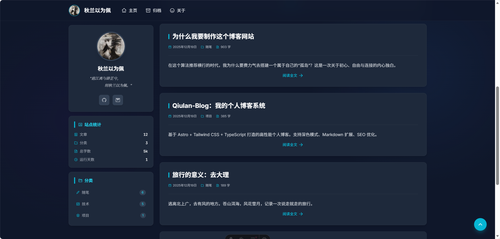

# 秋兰以为佩的博客

这是一个基于 [Astro](https://astro.build/) 构建的现代化个人技术博客。设计风格简约深邃，专注于阅读体验，适合用于记录技术心得、生活感悟和项目展示。



## ✨ 项目特色

- **高性能架构**：基于 Astro 的静态站点生成 (SSG)，首屏加载极快，SEO 友好。
- **现代化设计**：深色模式主题，沉浸式阅读体验，响应式布局适配移动端。
- **技术栈**：
  - **核心框架**: Astro 4.0
  - **UI 组件**: React 18
  - **样式库**: Tailwind CSS
  - **图标库**: Iconify
  - **类型安全**: TypeScript
- **功能模块**：
  - 首页文章列表与个人卡片
  - 文章详情页（支持代码高亮、目录导航）
  - 归档页（按时间线展示）
  - 分类与标签系统
  - 关于页面

## 🚀 快速开始

### 1. 环境准备

确保你的本地环境已安装：

- Node.js (推荐 v18 或 v20+)
- pnpm (推荐包管理器)

### 2. 安装依赖

```bash
# 克隆项目
git clone https://github.com/your-username/blog.git

# 进入目录
cd blog

# 安装依赖
pnpm install
```

### 3. 本地开发

启动本地开发服务器：

```bash
pnpm dev
```

浏览器访问 `http://localhost:4321` 即可预览。

### 4. 构建生产版本

```bash
pnpm build
```

构建产物将输出到 `dist/` 目录。

## ⚙️ 项目配置

### 修改个人信息

个人资料卡片（头像、昵称、社交链接）目前位于组件中，请修改以下文件：

- **文件路径**: `src/components/widgets/ProfileCard.astro`
- **修改内容**:
  - `h2` 标签内的名称
  - `img` 标签的头像路径 (图片放在 `public/` 目录下)
  - 社交链接 `href` 属性 (GitHub, Email 等)

### 发布新文章

文章内容存储在 `src/content/posts/` 目录下。

1. 在 `src/content/posts/` 中新建 `.md` 文件。
2. 文件头部添加 Frontmatter 信息：

```markdown
---
title: "文章标题"
description: "文章简要描述"
publishedAt: "2023-12-19"
category: "tech" # 可选值: tech (技术), essay (随笔), project (项目)
tags: ["标签1", "标签2"]
draft: false
---

这里是文章正文内容...
```

### 导航栏配置

导航栏链接可在 `src/components/Navbar.astro` 中修改。

## 📦 部署 (Netlify)

本项目已配置 `netlify.toml`，支持一键部署到 Netlify。

1. **推送到 GitHub**: 将代码提交并推送到你的 GitHub 仓库。
2. **连接 Netlify**:
   - 登录 Netlify。
   - 点击 "Add new site" -> "Import from an existing project"。
   - 选择 GitHub，并选中你的 `blog` 仓库。
3. **确认配置**:
   - Netlify 会自动读取 `netlify.toml` 配置。
   - **Build command**: `pnpm run build`
   - **Publish directory**: `dist`
4. **部署**: 点击 "Deploy site" 即可。

后续每次推送到 GitHub，Netlify 都会自动触发构建并更新站点。

## 📂 目录结构

```
blog/
├── public/             # 静态资源 (头像, 图片等)
├── src/
│   ├── components/     # UI 组件
│   ├── content/        # 内容集合 (文章 markdown)
│   ├── layouts/        # 页面布局
│   ├── pages/          # 路由页面 (Astro 路由)
│   ├── styles/         # 全局样式
│   └── utils/          # 工具函数
├── astro.config.mjs    # Astro 配置文件
├── netlify.toml        # Netlify 部署配置
└── tailwind.config.mjs # Tailwind 配置
```
